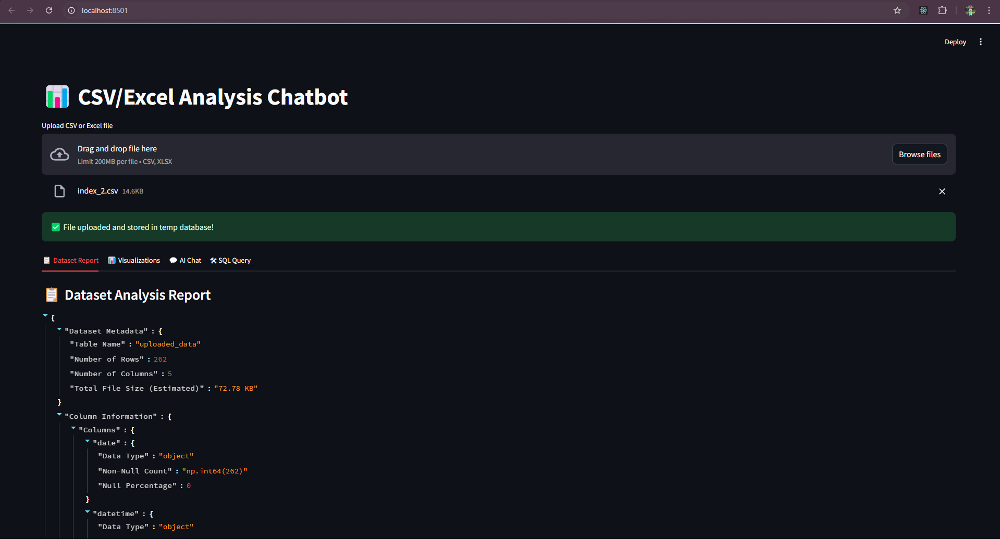
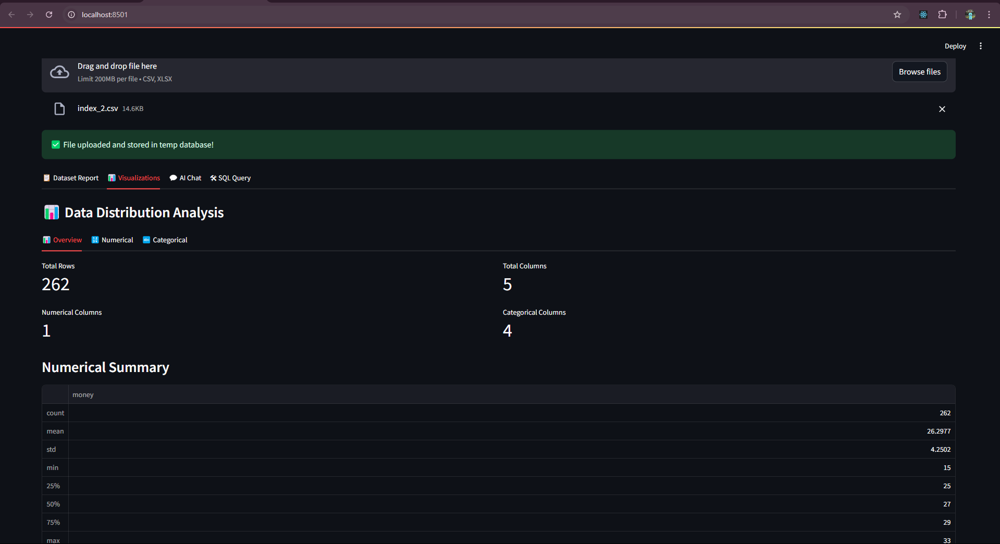
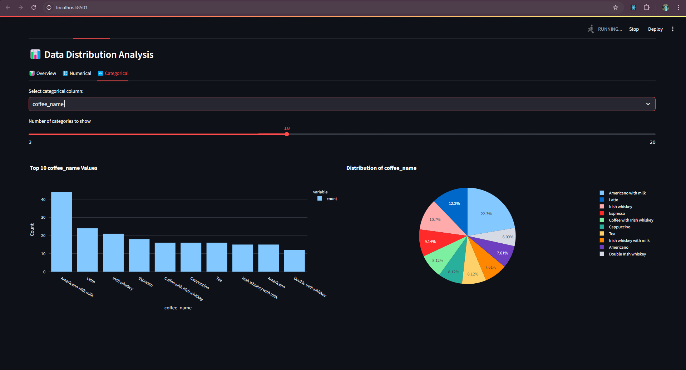
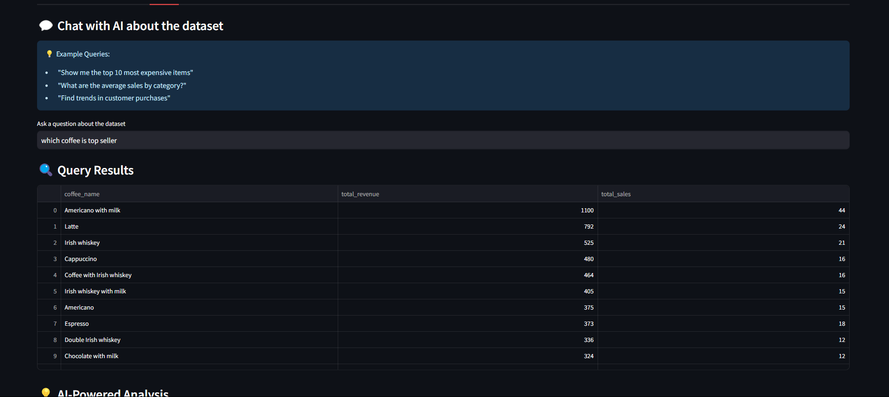
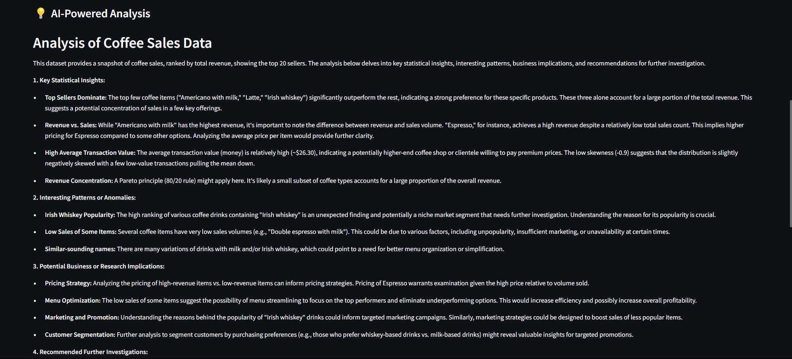
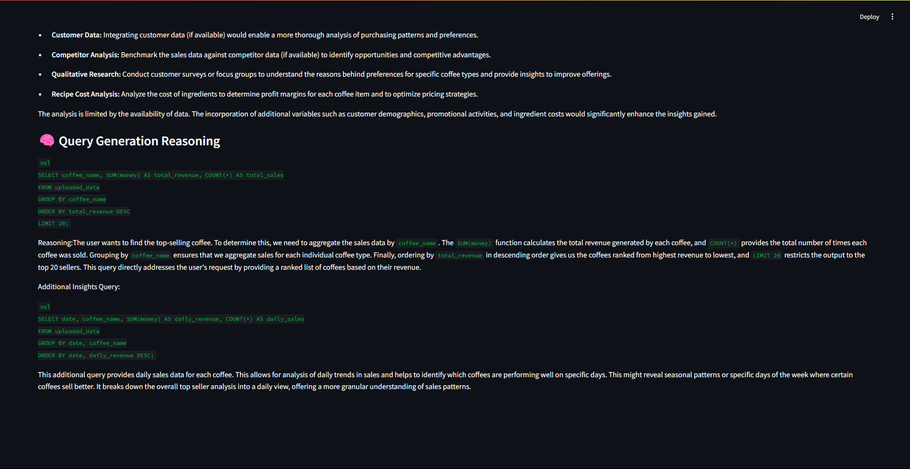
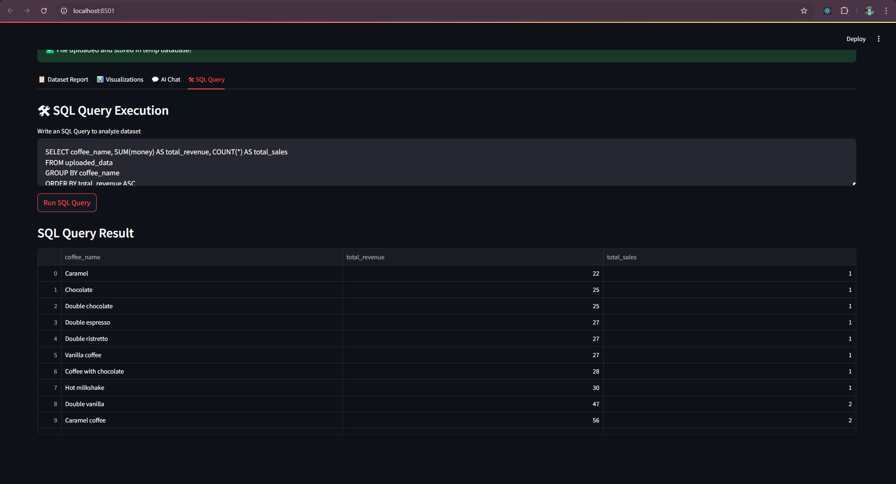

# 📊 Data Analysis Chatbot

A Streamlit-based interactive chatbot that allows users to upload CSV/Excel files, generate reports, visualize data distributions, and interact with an AI assistant to query insights using an embedded SQLite database.

## 🚀 Features

### 📋 Dataset Overview & Report Generation
- Automatically extracts key insights from the dataset.
- Displays the **five-number summary** (minimum, Q1, median, Q3, maximum).
- Summarizes numerical and categorical column distributions.

### 📊 Data Visualization
- Provides **distribution plots** for numerical data.
- Generates **bar charts & pie charts** for categorical data.

### 💬 AI-Powered Querying
- AI assistant queries the dataset using **natural language processing**.
- AI generates SQL queries to retrieve relevant data.
- Supports **follow-up questions** for deeper insights.

### 🛠 SQL Query Execution
- Users can write **custom SQL queries** to explore the dataset.
- SQL queries are executed on **an SQLite database**.
- Results are displayed in a structured table format.

## 🏗️ How It Works

1. **Upload Data**: Users upload a CSV or Excel file.
2. **Store in SQLite**: The dataset is stored temporarily in an SQLite database.
3. **Generate Report**: Summary statistics and insights are extracted.
4. **Data Visualization**: Graphical representation of data distributions.
5. **AI Chatbot Interaction**: Users ask queries, and the AI generates SQL responses with reasoning.
6. **Run Custom Queries**: Users can manually execute SQL queries to explore data further.

## 📦 Installation & Setup

```sh
# Clone the repository
git clone https://github.com/your-username/data-analysis-chatbot.git
cd data-analysis-chatbot

# Create a virtual environment
python -m venv venv
source venv/bin/activate  # On Windows use `venv\Scripts\activate`

# Install dependencies
pip install -r requirements.txt

# Run the Streamlit app
streamlit run app.py
```

## 🔍 Usage

1. **Upload** a CSV or Excel file.
2. Navigate through **Dataset Report**, **Visualizations**, **AI Chat**, or **SQL Query** tabs.
3. **Ask questions** in the AI Chat section for insights.
4. **Run SQL queries** to fetch specific data.

## 📷 Feature Snapshots

### 📋 Report Generation


### 📊 Data Visualization




### 💬 AI Chat with Reasoning




### 💬 Run SQL queries


## 🤖 Technologies Used
- **Streamlit** - Web UI
- **SQLite** - Database storage
- **Pandas** - Data processing
- **Plotly** - Interactive visualizations
- **LangChain / OpenAI API** - AI-powered querying

## 📝 Future Enhancements
- Add **more advanced AI-powered insights** (e.g., trend detection, clustering).
- Support for **more file formats**.
- Improve **performance for large datasets**.

## 🤝 Contributing
Feel free to contribute! Fork the repo, make changes, and submit a PR.

## 📜 License
This project is licensed under the MIT License.

---


